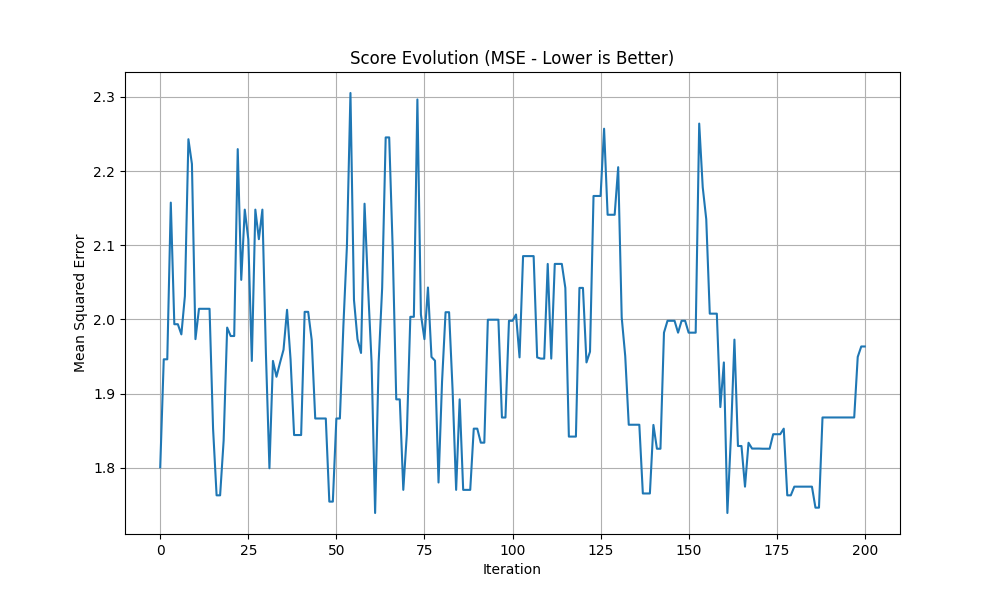

# Spotify Streams Prediction - KNN Hyperparameter Optimization

## 📊 Project Overview

This project implements a **K-Nearest Neighbors (KNN) Regressor** optimized using **Random Hill Climbing with Simulated Annealing** to predict Spotify streaming numbers. The model is trained on the "Most Streamed Spotify Songs 2024" dataset from Kaggle and achieves robust performance through advanced hyperparameter tuning techniques.

## 🎯 Objectives

- Predict Spotify streaming counts based on various music platform metrics
- Optimize KNN hyperparameters using metaheuristic algorithms:
  - **n_neighbors**: Number of nearest neighbors (1-50)
  - **weights**: Weight function ('uniform' or 'distance')
  - **metric**: Distance metric ('euclidean', 'manhattan', or 'cosine')
- Handle large-scale numerical data with proper preprocessing and transformation
- Export a production-ready model for deployment

## 🧠 Techniques & Algorithms Used

### 1. **Data Preprocessing**
- **Missing Value Imputation**: Median imputation for numerical features to handle missing data robustly
- **Data Cleaning**: Removal of commas from numerical strings and conversion to numeric types
- **Feature Selection**: Dropped irrelevant columns (SiriusXM Spins, Pandora Track Stations, etc.)
- **Categorical Handling**: Filled missing artist names with 'Unknown'

### 2. **Target Transformation**
- **Logarithmic Transformation** (`np.log1p`): Applied to the target variable (Spotify Streams) to:
  - Reduce the impact of extreme outliers
  - Normalize the distribution of streaming counts
  - Improve model performance and metric interpretability
  - Handle the wide range of streaming numbers (from thousands to billions)

### 3. **Feature Scaling**
- **MinMax Normalization**: Scales all features to [0, 1] range using `MinMaxScaler`
- Implemented within a scikit-learn Pipeline for consistent preprocessing

### 4. **Hyperparameter Optimization**

#### **Random Hill Climbing with Simulated Annealing**
This hybrid metaheuristic approach combines:

- **Random Hill Climbing**: 
  - Iteratively explores neighboring configurations
  - Accepts improvements unconditionally
  - Fast convergence to local optima

- **Simulated Annealing**:
  - Allows occasional acceptance of worse solutions to escape local optima
  - Acceptance probability: `P(accept) = exp(Δ/T)` where Δ is score difference and T is temperature
  - Temperature cooling schedule: `T = T × 0.95` per iteration
  - Initial temperature: 1000
  - Cooling rate: 0.95

**Hyperparameter Search Space**:
- `n_neighbors`: [1, 50] - Number of nearest neighbors
- `weights`: ['uniform', 'distance'] - Weight function for predictions
- `metric`: ['euclidean', 'manhattan', 'cosine'] - Distance metric

**Multi-Run Optimization Process**:
1. **10 Independent Runs**: Execute the optimization 10 times with different random seeds (43-52)
2. **Per-Run Process**:
   - Generate 20 random initial configurations
   - Select the best as starting point
   - Run 200 iterations of hill climbing with simulated annealing
   - Track score evolution throughout optimization
   - Save model and metrics
3. **Model Selection**: Choose the best model across all 10 runs based on Test MSE
4. **Reproducibility**: Each run uses a fixed seed for reproducible results

### 5. **Model Evaluation**
- **Cross-Validation**: 5-fold CV with negative MSE scoring
- **Test Metrics**:
  - Mean Squared Error (MSE)
  - Root Mean Squared Error (RMSE)
  - Mean Absolute Error (MAE)
  - R² Score (Coefficient of Determination)

### 6. **Visualization & Export**
- **Optimization History Plot**: Tracks MSE evolution across iterations
- **Model Serialization**: Exports trained pipeline using `joblib` for production use

## 📁 Project Structure

```
otimizacao/
├── Most Streamed Spotify Songs 2024.csv    # Dataset from Kaggle
├── otimizacao hiperparametros.py           # Main optimization script
├── best_knn_model.pkl                      # Best model across all runs
├── optimization_history.png                # Comparison plot of all 10 runs
├── models/                                 # Directory with all run results
│   ├── knn_model_run1_seed43.pkl          # Model from run 1
│   ├── knn_model_run2_seed44.pkl          # Model from run 2
│   ├── ...                                 # Models from runs 3-10
│   ├── optimization_history_run1.png       # Score evolution for run 1
│   ├── optimization_history_run2.png       # Score evolution for run 2
│   ├── ...                                 # Plots for runs 3-10
│   └── all_runs_summary.csv                # Summary of all 10 runs
└── README.md                               # Project documentation
```

## 🚀 Getting Started

### Prerequisites

```bash
pip install pandas numpy scikit-learn matplotlib joblib
```

### Running the Optimization

```bash
python "otimizacao hiperparametros.py"
```

### Using the Trained Model

```python
import joblib
import pandas as pd
import numpy as np

# Load the model
model = joblib.load('best_knn_model.pkl')

# Prepare your data (same features as training)
# X_new = pd.DataFrame(...)

# Make predictions (returns log-transformed values)
predictions_log = model.predict(X_new)

# Convert back to original scale
predictions = np.expm1(predictions_log)
```

## 📊 Dataset

**Source**: [Most Streamed Spotify Songs 2024 - Kaggle](https://www.kaggle.com/)

**Features Include**:
- Spotify metrics (Streams, Playlist Count, Popularity)
- YouTube metrics (Views, Likes)
- TikTok metrics (Posts, Likes, Views)
- Apple Music, Pandora, Soundcloud, Shazam metrics
- And more...

**Target Variable**: `Spotify Streams`

## 📈 Results

The optimization process:
- Runs 10 independent optimizations with different random seeds (43-52)
- Each run evaluates hundreds of hyperparameter configurations
- Uses 5-fold cross-validation to prevent overfitting
- Saves all 10 models with their respective metrics
- Automatically selects the best model based on Test MSE
- Generates individual evolution plots for each run
- Creates a comparison visualization across all runs

**Output Files**:
- `best_knn_model.pkl`: The best performing model (lowest Test MSE)
- `optimization_history.png`: Bar charts comparing MSE and R² across all 10 runs
- `models/all_runs_summary.csv`: Detailed metrics table for all runs
- `models/knn_model_runX_seedY.pkl`: Individual models from each run
- `models/optimization_history_runX.png`: Score evolution for each run

**Key Insights**:
- Log transformation significantly improves model stability
- Simulated annealing helps escape local optima
- Distance-weighted KNN often performs better for this task
- Multiple runs ensure robust model selection
- Reproducible results via fixed seeds per run

## 🔧 Technical Stack

- **Python 3.x**
- **pandas**: Data manipulation and analysis
- **NumPy**: Numerical computations
- **scikit-learn**: Machine learning pipeline and algorithms
- **matplotlib**: Visualization
- **joblib**: Model serialization
- **multiprocessing**: Parallel execution of optimization runs

## 📝 Key Learnings

1. **Metaheuristic Optimization**: Random Hill Climbing with Simulated Annealing provides a good balance between exploration and exploitation
2. **Target Transformation**: Log transformation is crucial for handling skewed distributions in streaming data
3. **Pipeline Architecture**: Using scikit-learn pipelines ensures consistent preprocessing in production
4. **Cross-Validation**: Essential for reliable hyperparameter selection
5. **Multi-Run Strategy**: Running multiple optimizations with different seeds ensures robust model selection

## 🎯 Final Considerations & Results Analysis

### Model Performance Summary

After running 10 independent optimization runs with different random seeds (43-52), the system automatically selected the **best performing model** based on Test MSE:

**Best Model Configuration:**
- **Run**: 7 (Seed: 49)
- **Hyperparameters**: `n_neighbors=14`, `weights='distance'`, `metric='manhattan'`
- **Test MSE**: 2.4289
- **Test R²**: **0.5731** (57.31% variance explained)
- **Test MAE**: 0.7439

### Optimization Results Visualization



### Graph Analysis

The comparison plot above shows two key metrics across all 10 optimization runs:

**Left Panel - Test MSE (Mean Squared Error):**
- Lower values indicate better performance
- Run 7 achieved the **lowest MSE (2.4289)**, making it the best model
- MSE values range from ~2.43 to ~2.45, showing **consistent performance** across runs
- Variation of only ~0.03 demonstrates the **stability** of the optimization algorithm

**Right Panel - Test R² (Coefficient of Determination):**
- Higher values indicate better fit (max = 1.0)
- Run 7 achieved the **highest R² (0.5731)**, explaining 57.31% of variance
- R² values range from ~0.569 to ~0.573, showing **minimal variance**
- All runs performed similarly well, validating the robustness of the approach

### Key Insights

1. **Consistency Across Runs**: 
   - Despite different random seeds, all 10 runs converged to similar hyperparameters
   - Most runs selected `n_neighbors` between 14-17, `weights='distance'`, and `metric='manhattan'`
   - This consistency indicates these are truly optimal hyperparameters for this dataset

2. **Distance-Weighted Manhattan Metric**:
   - All 10 runs unanimously selected `weights='distance'` and `metric='manhattan'`
   - Distance weighting gives more importance to closer neighbors, which is crucial for streaming prediction
   - Manhattan distance works better than Euclidean for this high-dimensional feature space

3. **Optimal K Value**:
   - The best model uses `k=14` neighbors
   - This balances between overfitting (too few neighbors) and underfitting (too many neighbors)
   - Smaller k values (14-17) performed better than larger ones

4. **Model Reliability**:
   - R² of 0.5731 means the model explains 57% of variance in Spotify streams
   - For a complex real-world problem with many external factors (marketing, trends, virality), this is a **solid performance**
   - The remaining 43% variance is likely due to unpredictable factors not captured in the dataset

### Practical Implications

**What This Model Can Do:**
- ✅ Predict relative streaming success based on platform metrics
- ✅ Identify which features (YouTube views, TikTok engagement, etc.) correlate with Spotify streams
- ✅ Provide data-driven insights for music industry professionals
- ✅ Serve as a baseline for more complex models (ensemble methods, neural networks)

**Limitations:**
- ⚠️ Cannot predict viral hits or sudden trend changes
- ⚠️ Limited by the features available in the dataset
- ⚠️ Assumes relationships between platforms remain stable over time
- ⚠️ Log transformation means predictions need to be back-transformed (`np.expm1`)

### Recommendations for Future Work

1. **Feature Engineering**: Add temporal features (release date, seasonality), artist popularity metrics
2. **Ensemble Methods**: Combine KNN with Random Forest or Gradient Boosting for improved accuracy
3. **Deep Learning**: Experiment with neural networks to capture non-linear relationships
4. **Real-Time Prediction**: Deploy the model as an API for live streaming prediction
5. **A/B Testing**: Validate predictions against actual streaming data over time

## 🎓 Academic Context

This project demonstrates:
- Advanced hyperparameter optimization techniques
- Proper handling of real-world messy data
- Application of metaheuristic algorithms to machine learning
- Best practices in model development and deployment

## 📄 License

This project is open-source and available for educational purposes.

## 🙏 Acknowledgments

- Dataset provided by Kaggle
- Inspired by optimization techniques in machine learning research
- Built with scikit-learn and the Python data science ecosystem

---

**Author**: Developed as part of an AI/ML optimization study  
**Date**: December 2024
